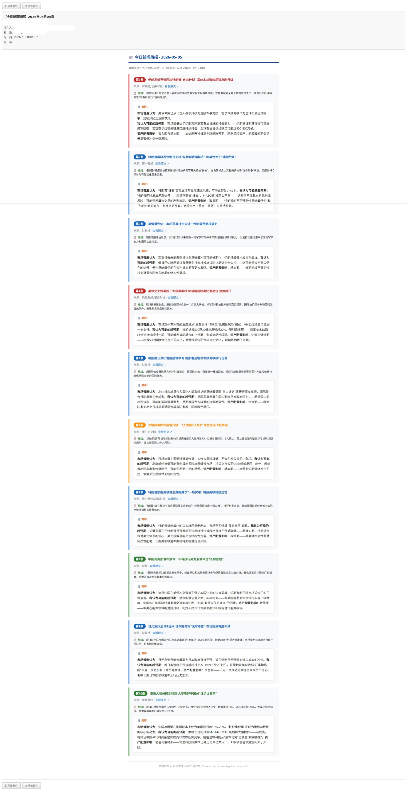

# 每日财经新闻简报 CronJob

自动采集 22 个财经网站的每日新闻，经 TF-IDF 粗筛 + AI 语义精筛后，生成专业宏观策略简报并发送邮件。

> 参考文章：[[手把手] 如何0代码用openclaw定时推送晨报和简评：金融人的AI助理](https://zhuanlan.zhihu.com/p/2012947339308983868)



## 工作流程

```
Python 采集脚本 → JSON stdout → Agent 语义分析 → HTML 邮件 + CSV 存档
```

1. **数据采集** (`scripts/financial_news_collect.py`)：抓取 22 个财经网站（昨日 08:00 ~ 今日 08:00），含反爬策略（浏览器指纹池、随机延迟、自动重试）
2. **TF-IDF 粗筛**：基于 jieba 分词 + 余弦相似度（阈值 0.85）去除字面重复
3. **AI 语义精筛**（`prompt.md`）：Agent 接收 JSON 后执行语义去重、重要性排序（Top ≤10）、提取全文生成总结与专业简评
4. **输出**：HTML 富文本邮件 + CSV 存档至 `~/financial-news-daily/output/{date}/`

## 覆盖数据源（22个）

| 类型 | 来源 | URL |
|------|------|-----|
| 综合财经 | 华尔街见闻 | https://wallstreetcn.com/ |
| 综合财经 | 第一财经 | https://www.yicai.com/ |
| 综合财经 | 财新 | https://www.caixin.com/ |
| 综合财经 | 新浪财经 | https://finance.sina.com.cn/ |
| 综合财经 | 凤凰网财经 | https://finance.ifeng.com/ |
| 综合财经 | 新华财经 | https://www.cnfin.com/ |
| 官方机构 | 发改委 | https://www.ndrc.gov.cn/ |
| 官方机构 | 财政部 | https://www.mof.gov.cn/zhengwuxinxi/ |
| 官方机构 | 金管总局 | https://www.nfra.gov.cn/ |
| 官方机构 | 人民银行 | https://www.pbc.gov.cn/ |
| 官方机构 | 美联储 | https://www.federalreserve.gov/default.htm |
| 财经媒体 | 财联社 | https://www.cls.cn/ |
| 财经媒体 | 上证报 | https://www.cnstock.com/ |
| 财经媒体 | 证券时报 | https://www.stcn.com/ |
| 财经媒体 | FT中文网 | https://m.ftchinese.com/ |
| 科技商业 | 36氪 | https://www.36kr.com/ |
| 科技商业 | 虎嗅网 | https://www.huxiu.com/ |
| 科技商业 | TechCrunch | https://techcrunch.com/ |
| 数据/能源 | Trading Economics | https://tradingeconomics.com/ |
| 数据/能源 | 百川盈孚 | https://www.baiinfo.com/ |
| 数据/能源 | 财新-能源 | https://www.caixin.com/energy/ |
| 其他 | 中国经济网 | http://www.ce.cn/ |

## 文件说明

```
financial_news/
├── README.md
├── prompt.md
├── snapshot.jpeg
└── scripts/
```

## 使用方法

### 一键安装

将以下 prompt 直接发送给 Agent，自动完成克隆、安装依赖、配置：

```
帮我安装每日财经新闻简报 CronJob：
1. 克隆仓库 git clone https://github.com/wshape1/agent-cronjob-templates.git （如失败用备用源 https://gitee.com/wshape1/agent-cronjob-templates.git ）
2. 安装 Python 依赖：pip install httpx beautifulsoup4 lxml jieba
3. 将 financial_news/prompt.md 设为 CronJob 的 prompt
4. 将 financial_news/scripts/financial_news_collect.py 设为采集脚本
5. 提醒我修改 financial_news/scripts/fnd_finance_config.json 中的邮件收件人
```

### 手动安装

**1. 安装依赖**

```bash
pip install httpx beautifulsoup4 lxml jieba
```

**2. 修改配置**

编辑 `scripts/fnd_finance_config.json`：

```json
{
  "email": {
    "to": "youremail@example.com",
    "cc": "",
    "subject_prefix": "【今日新闻简报】"
  }
}
```

**3. 手动测试**

```bash
python scripts/financial_news_collect.py
```

stdout 输出 JSON，可直接粘贴到 Agent 验证 prompt 效果。

## 简报特点

- **"五碗面"分析框架**：政策面、基本面、资金面、估值与情绪面、技术面
- **超预期视角**：每条简评包含"市场可能忽略的尾部风险或增量信息"
- **提取失败容错**：原文不可访问时自动降级为标题摘要，标记 ⚠️
- **反爬优化**：7 种浏览器指纹随机切换，模拟人类浏览时序
