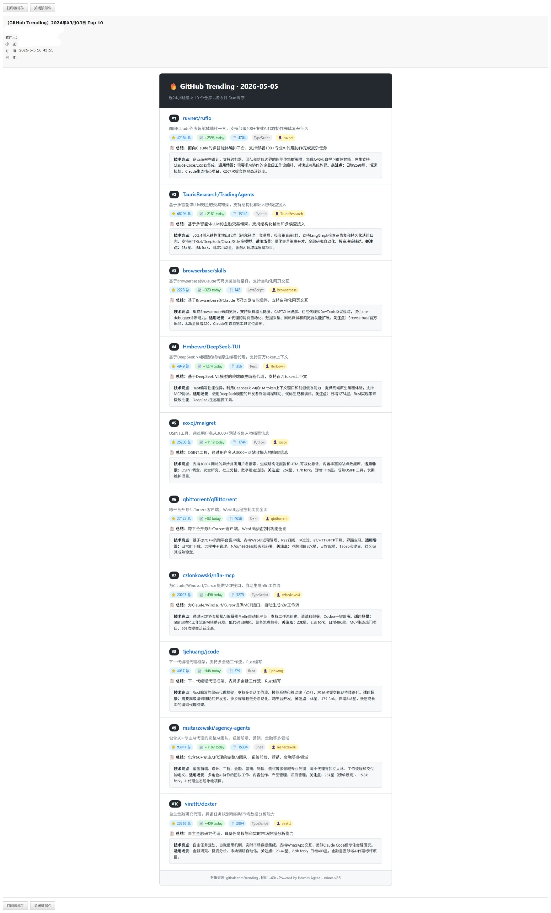

# GitHub Trending 每日简报 CronJob

自动采集 GitHub 近 24 小时 Trending 仓库（Top 10），由 AI 生成技术简评并发送邮件。



## 工作流程

```
Python 采集脚本 → JSON stdout → Agent 分析 → HTML 邮件 + CSV 存档
```

1. **数据采集** (`scripts/github_trending_collect.py`)：抓取 GitHub Trending 页面，提取仓库名、描述、语言、Star 数、Fork 数等
2. **AI 分析**（`prompt.md`）：Agent 访问每个仓库 README，生成一句话总结 + 专业简评（技术亮点、适用场景、社区活跃度）
3. **输出**：HTML 邮件 + CSV 存档至 `~/github-trending/output/{date}/`

## 文件说明

```
github_trending/
├── README.md
├── prompt.md
├── snapshot.jpeg
└── scripts/
```

## 使用方法

### 一键安装

将以下 prompt 直接发送给 Agent，自动完成克隆、安装依赖、配置：

```
帮我安装 GitHub Trending 每日简报 CronJob：
1. 克隆仓库 git clone https://github.com/wshape1/agent-cronjobs-template.git （如失败用备用源 https://gitee.com/wshape1/agent-cronjobs-template.git ）
2. 安装 Python 依赖：pip install httpx beautifulsoup4
3. 将 github_trending/prompt.md 设为 CronJob 的 prompt
4. 将 github_trending/scripts/github_trending_collect.py 设为采集脚本
5. 提醒我修改 github_trending/scripts/fnd_github_config.json 中的邮件收件人
```

### 手动安装

**1. 安装依赖**

```bash
pip install httpx beautifulsoup4
```

**2. 修改配置**

编辑 `scripts/fnd_github_config.json`：

```json
{
  "email": {
    "to": "youremail@example.com",
    "cc": "",
    "subject_prefix": "【GitHub Trending】"
  }
}
```

**3. 手动测试**

```bash
python scripts/github_trending_collect.py
```

stdout 输出 JSON，可直接粘贴到 Agent 验证 prompt 效果。

## 简报内容

每个仓库包含：

| 字段 | 说明 |
|------|------|
| 排名 | 按今日 Star 降序 (#1 ~ #10) |
| 仓库信息 | 全名、描述、语言、Star/Fork 数 |
| 一句话总结 | 项目做什么、核心卖点（≤50字） |
| 专业简评 | 技术亮点 + 适用场景 + 社区活跃度（60-120字） |
